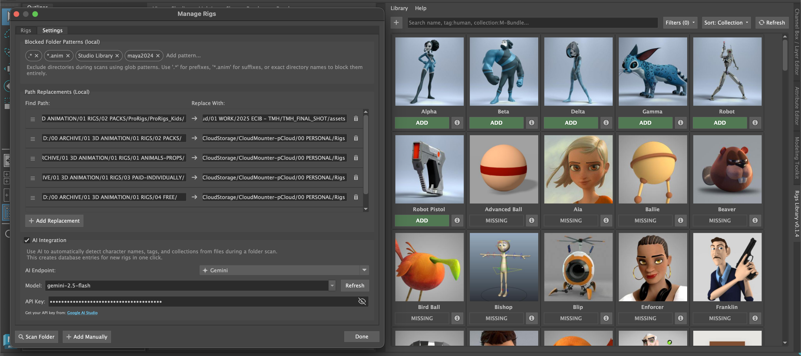
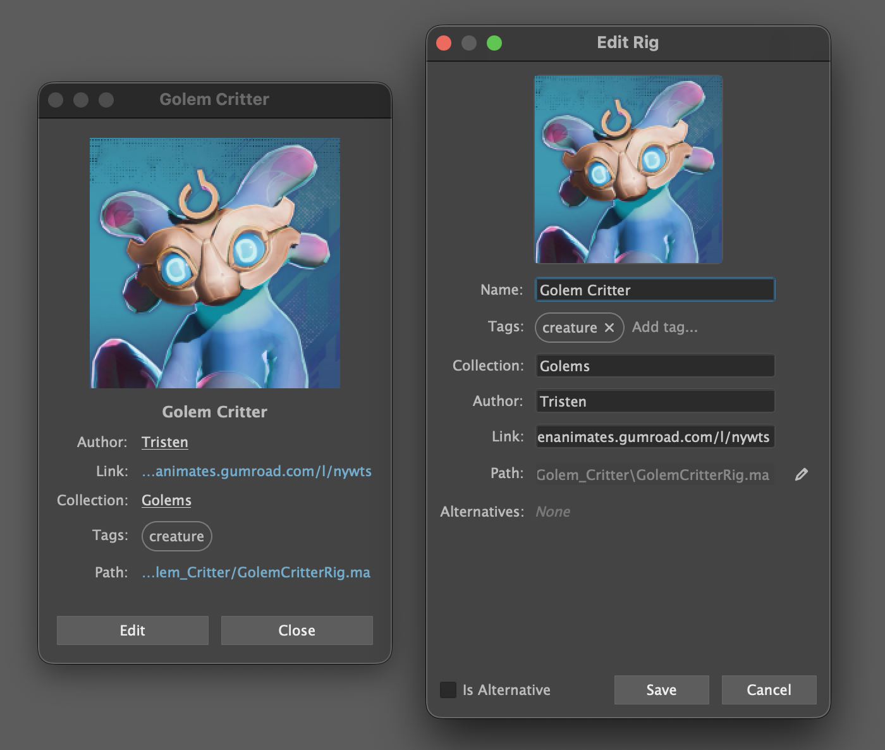
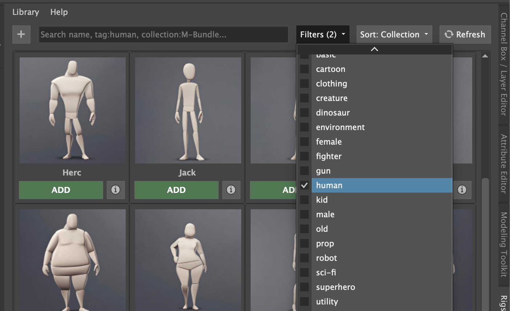

# Rigs Library (RigsUI)

A professional Maya tool for organizing and managing 3D rig assets. Provides a dockable interface to easily browse, filter, and load rigs into your Maya scene.



## Features

- **Smart Filtering**: Filter rigs by **Collection**, **Tags**, or **Author**.
- **Advanced Search**: Search by name or use specific filters (e.g., `tag:human`, `author:ProRigs`).
- **Sorting**: Sort library by Name, Collection, or Author.
- **Batch Import**: Scan entire folders for rapid library expansion. Customize **Blocked Patterns** to skip unneeded directories.
- **Path Replacements**: Define local path swaps to share databases across different machines without breaking paths.
- **AI Auto-Tagging**: Automatically add metadata using **Gemini**, **ChatGPT**, **Claude**, **Grok**, **OpenRouter** or custom endpoints.

### Edit Rig Details

View and modify rig metadata including name, collection, author, tags, and thumbnail.



<blockquote>Featuring the rig [Golem Critter](https://tristenanimates.gumroad.com/l/nywts) by Tristen</blockquote>

### Smart Filtering

Quickly find rigs using filters for collection, tags, author, or status.



<blockquote>Featuring the [Body Mechanics Rigs](https://joedanimation.gumroad.com/l/xhRK) by Joe Daniels</blockquote>

## Installation

Copy the `RigsUI` folder to your Maya scripts directory:
   - **Windows**: `C:\Users\<NAME>\Documents\maya\scripts\`
   - **macOS**: `~/Library/Preferences/Autodesk/maya/scripts/`
   - **Linux**: `~/maya/scripts/`

## Usage

Run the following python code in the Maya Script Editor (Python tab):

```python
import RigsUI
RigsUI.show()
```

### Adding Rigs

**Add One Rig**:
1. Click the **+** (Add) button and select **Add Manually**.
2. Select a Maya file (`.ma` or `.mb`).
3. Fill in the details (Name, Collection, Author, Tags).
4. The rig is added to the library.

**Add Multiple Rigs**:
1. Click the **+** (Add) button and select **Scan Folder**.
2. Select a directory to scan.
3. Review discovered rigs, categorize them, or add them instantly using the scanner UI.

### Managing Rigs
1. **Info & Edit**: Click the ⓘ button to view rig details. 
2. **Context Menu**: Right-click the ⓘ button to access advanced actions:
   - **Edit Details**: Modification of metadata.
   - **Open Rig Scene**: Opens the original file in a new Maya scene.
   - **Show in Folder**: Reveals the file in Explorer/Finder.
   - **Remove Rig**: Removes the entry from the library.

## Requirements

- Autodesk Maya 2022+ or higher.
- Python 3. Working on Python 2 compatibility.
- Standard Maya Python environment (`maya.cmds`, `PySide2` or `PySide6`)

## Changelog

Check it out on [CHANGELOG.md](CHANGELOG.md).

## Issues

If you find any issues, please report them on the [GitHub issue tracker](https://github.com/Alehaaaa/RigsUI/issues).

## Contributing

Contributions are welcome! Please submit a pull request.

## Transparency

The source code was written by me, **Alehaaaa**, with significant assistance from AI tools.
Specifically, **AI Agents** (like Gemini within Antigravity or ChatGPT) and manual contributors.

- Check out Antigravity here: [https://antigravity.google/](https://antigravity.google/)
- And ChatGPT here: [https://chat.openai.com/](https://chat.openai.com/)

## License

MIT License. See [LICENSE](LICENSE) for details.
